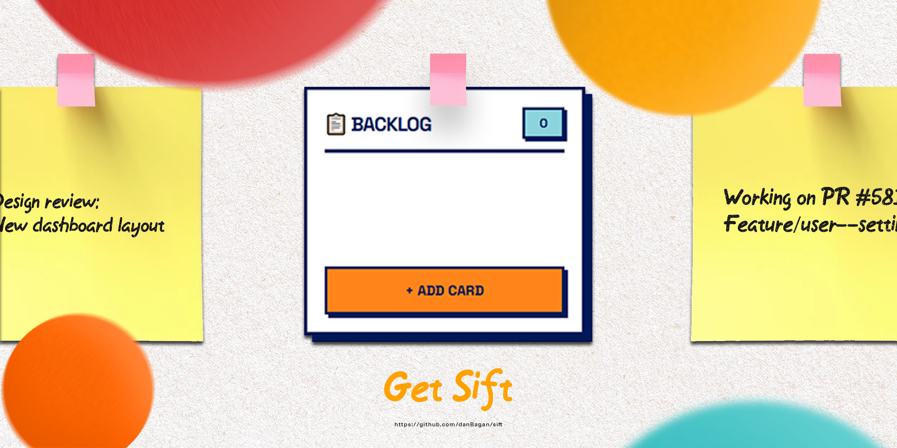
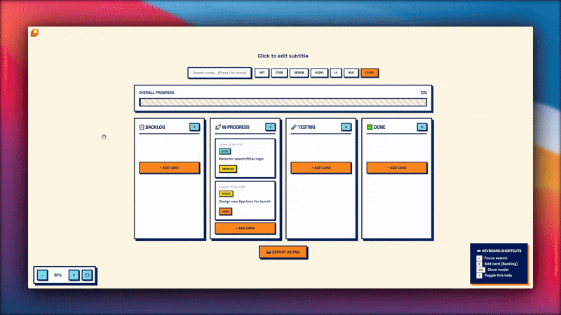

<div align="center">
<h1 style="margin-bottom: 0;">🔨 Sift - Simple, Brutal & FREE Task Management</h1>
</div>
<p align="center">
    </p>
<p align="center">

  
</p>

## ✨ The Premise

Tired of feature bloat, complex pricing tiers, and interfaces that try too hard? **Sift** is your antidote.

This is a lightweight, high-performance desktop application designed for task and project management, inspired by the utility of Trello but stripped down to the essentials.

We embrace a **Neo-Brutalist** design ethos—focusing on clarity, strong typography, deliberate use of color, and minimal visual embellishment—to deliver an interface that is honest, fast, and intensely usable.

**The best part? It's 100% FREE. No hidden costs, no premium features, just pure task management.**

---

# FOLLOW US ON TWITTER FOR UPDATES
<a href="https://x.com/app_sift" target="_blank"></a>

---

## 💡 Key Features & Brutalist Simplicity

| Feature Category          | Description                                                                                    | Core Value              |
| :------------------------ | :--------------------------------------------------------------------------------------------- | :---------------------- |
| **Neo-Brutalist UI**      | Bold colors, strong borders, high-contrast elements. An interface that gets out of your way.   | **Speed & Clarity**     |
| **Lightweight Engine**    | Built for desktop performance. Low CPU/Memory usage, instant responsiveness.                   | **Efficiency**          |
| **Familiar Board System** | Organize tasks into columns (To Do, In Progress, Done, etc.)—just like the best task managers. | **Instant Familiarity** |
| **Keyboard Shortcuts**    | Simple Keyboard Shortcuts to improve your workflow                                             | **Efficiency**          |
| **Canvas Focused**        | Hold Middle Mouse Button Down to Pan around the canvas. Zoom Controls for ease of access.      | **Dragable Area**       |
| **100% FREE**             | No sign-ups, no subscriptions, no ads, no "Pro" version.                                       | **Accessibility**       |
| **Portable**              | Download and run. No complicated installation process.                                         | **Zero Friction**       |

---

## 📷 Preview

<p align="center">
  
</p>

---

## 🛠️ Technology Stack

This project is built to be fast and reliable.

- **Frontend:** HTML
- **Desktop App:** Electron.js
- **Styling:** CSS
- **Language:** JavaScript

---

## ⬇️ Installation & Getting Started

**Sift** is currently available for: **Windows(exe)** & **Linux(nupkg)**.

### 🏗️ Build from Source (For Developers)

If you prefer to build the application yourself or contribute to development:

1.  **Clone the repository:**
    ```bash
    git clone https://github.com/danBagan/sift.git
    cd sift
    ```
2.  **Install dependencies:**
    ```bash
    npm install  # or yarn install
    ```
3.  **Run in development mode:**
    ```bash
    npm run start  # or yarn dev
    ```

---
